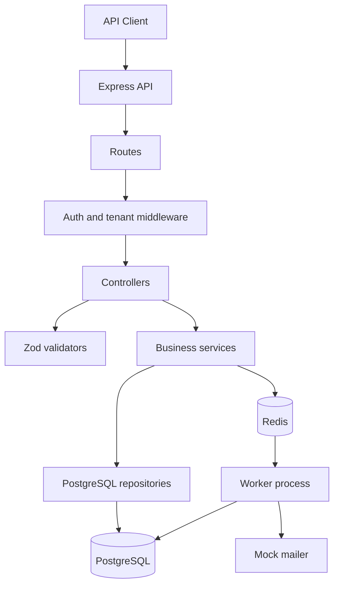
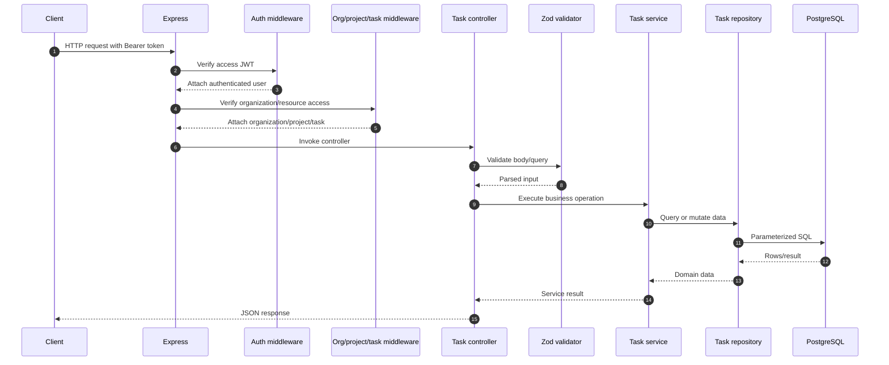
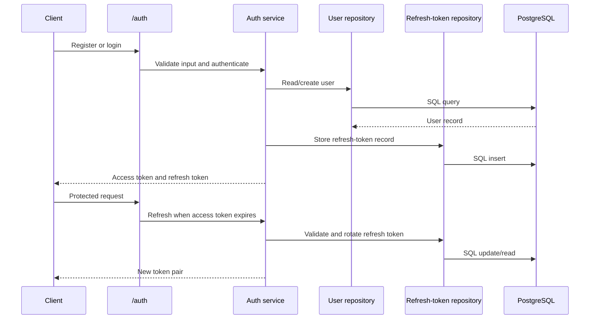
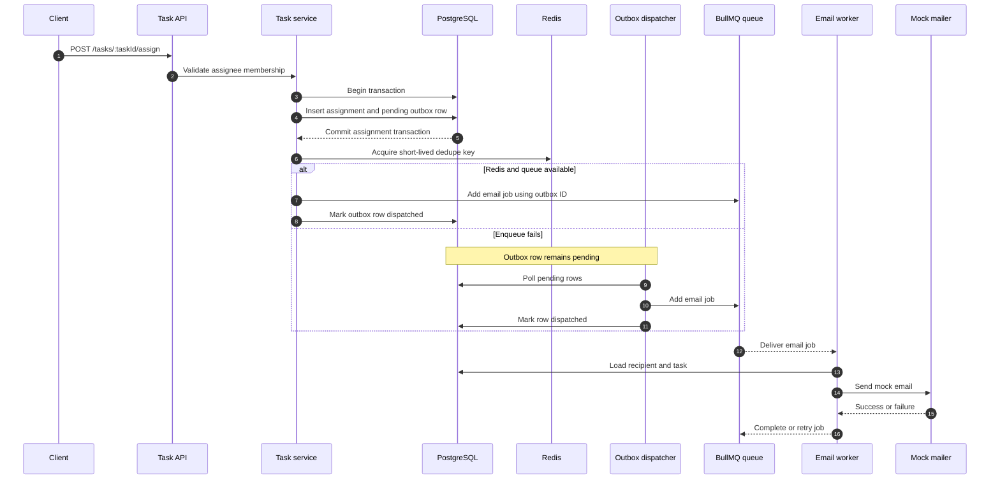
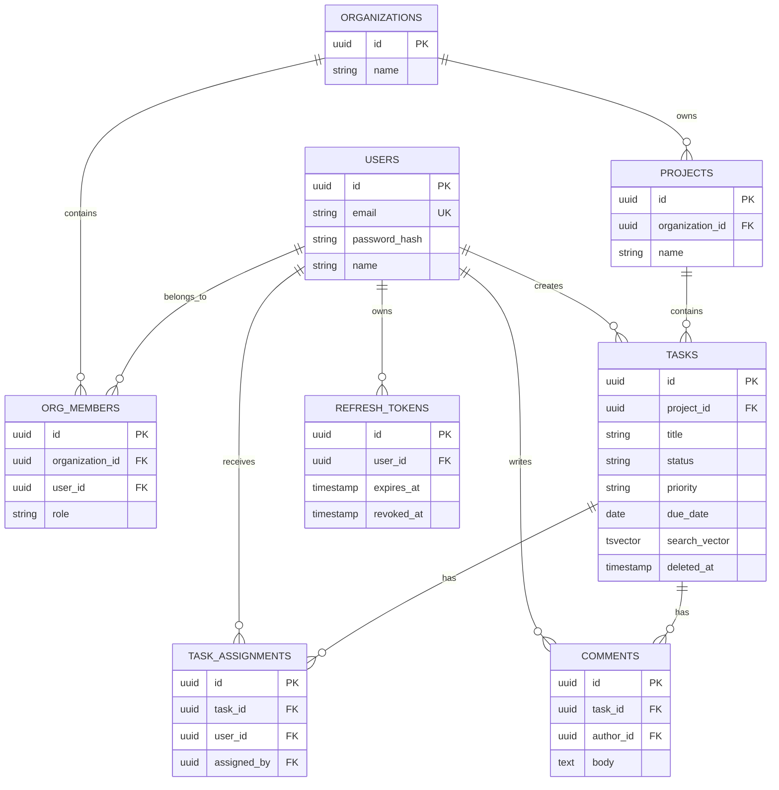
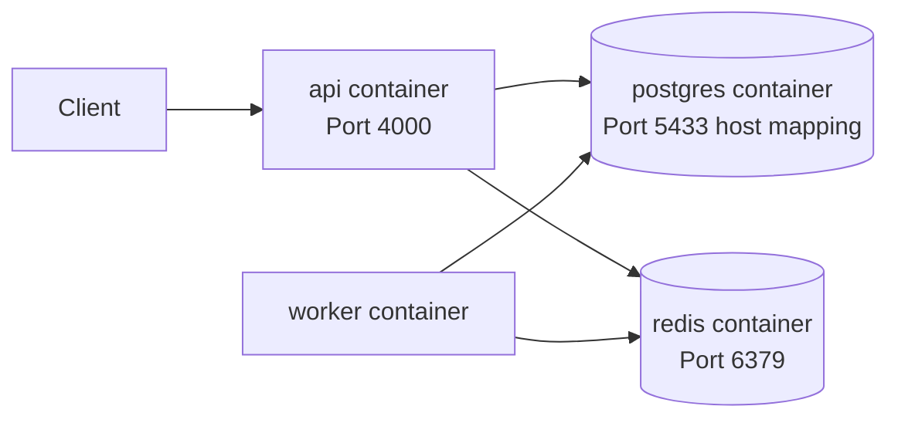

# TaskFlow System Architecture

## 1. System Overview

TaskFlow is a multi-tenant project and task management REST API. It provides authentication, organization membership, project management, task management, task assignments, pagination, filtering, full-text task search, and asynchronous assignment email notifications. Comments currently exist in the database schema and seed data but are not exposed through API endpoints.

The system is split into two runtime processes:

- **API process:** accepts HTTP requests, authenticates users, applies tenant/resource authorization, executes business operations, and returns JSON responses.
- **Worker process:** processes asynchronous email jobs and dispatches pending notification-outbox records.

PostgreSQL is the source of truth for application data. Redis is used as the BullMQ transport and for short-lived notification deduplication keys.

## 2. Architecture Style

The application follows a layered modular monolith pattern:

This structure keeps HTTP concerns in controllers, business rules in services, and SQL/persistence concerns in repositories while keeping deployment relatively simple.

## 3. Technologies

| Area | Technology | Purpose |
| --- | --- | --- |
| Language | TypeScript | Application implementation and type safety |
| Runtime | Node.js | API and worker execution |
| HTTP framework | Express 5 | Routing, middleware, and HTTP handling |
| Database | PostgreSQL 16 | Persistent transactional storage |
| Database client | `pg` | PostgreSQL connection pool and queries |
| Migrations | `node-pg-migrate` | Versioned schema changes |
| Cache/transport | Redis 7 and ioredis | BullMQ transport and short-lived deduplication |
| Job queue | BullMQ | Retryable asynchronous email jobs |
| Authentication | JWT and bcrypt | Access/refresh tokens and password hashing |
| Validation | Zod | Request body and query validation |
| API documentation | OpenAPI and Swagger UI | Interactive API documentation at `/docs` |
| Testing | Vitest and Supertest | Unit and integration tests |
| Local orchestration | Docker Compose | PostgreSQL, Redis, API, and worker services |

Key configuration is loaded in [src/config/env.ts](../src/config/env.ts). Required runtime variables include `DATABASE_URL`, `REDIS_URL`, `JWT_ACCESS_SECRET`, and `JWT_REFRESH_SECRET`.

## 4. Runtime Components

### 4.1 API Server

[src/server.ts](../src/server.ts) starts the HTTP server on the configured port. [src/app.ts](../src/app.ts) creates the Express application and configures:

- JSON request parsing
- Reverse-proxy trust
- Swagger UI at `/docs`
- Authentication routes at `/auth`
- Organization/project routes at `/organizations/:orgId/projects`
- Job inspection/management routes at `/jobs`
- Centralized error handling

### 4.2 Routing and Controllers

Routes define the public HTTP surface and connect endpoints to controllers:

- [src/routes/auth.route.ts](../src/routes/auth.route.ts): register, login, refresh, logout, and logout-all
- [src/routes/org.route.ts](../src/routes/org.route.ts): organization member listing and member invitation/creation
- [src/routes/project.route.ts](../src/routes/project.route.ts): project CRUD, dashboard, and nested task routes
- [src/routes/task.route.ts](../src/routes/task.route.ts): task CRUD, search, bulk status updates, assignment, and unassignment
- [src/routes/job.route.ts](../src/routes/job.route.ts): authenticated job-related operations

The route set includes organization-scoped member management and project dashboard tasks that were intentionally added to cover the real multi-tenant workflow:

- `GET /organizations/:orgId/members`
- `POST /organizations/:orgId/members`
- `GET /organizations/:orgId/projects/:projectId/dashboard`
- `PATCH /organizations/:orgId/projects/:projectId/tasks/bulk-status`
- `GET /organizations/:orgId/projects/:projectId/tasks/search`

### Comments Status

Comments are currently persistence-only. The migration creates a `comments` table and the seed script inserts sample comments, but there is no comment route, controller, service, or repository in the current application. Therefore, comments are represented in the database model but are not yet exposed through the REST API.

The existing schema links each comment to a task and author, stores the comment body and timestamps, cascades when its task is deleted, and restricts deletion of an author referenced by a comment. A future implementation would add task-scoped comment endpoints and authorization based on organization membership plus comment ownership or role.

Controllers perform three tasks:

1. Parse and validate request input.
2. Pass authenticated user and loaded resource context to a service.
3. Convert the service result into an HTTP response and forward errors to the error handler.

### 4.3 Middleware and Tenant Isolation

Protected organization/project requests pass through middleware in this order:

1. `requireAuth` validates the Bearer access token and sets `req.user`.
2. `requireOrgMembership` verifies that the user belongs to the requested organization.
3. `loadProject` loads the requested project and attaches it to the request.
4. `loadTask` loads the requested task for task-specific endpoints.
5. Role checks such as `requireRole("org_admin")` protect administrative operations.

This makes the organization ID part of the resource access path and prevents ordinary project/task operations from bypassing organization membership checks.

### 4.4 Services

Services contain application rules that may span multiple repositories or external systems:

- `auth.service.ts`: account creation, login, refresh-token rotation, logout, and logout-all behavior
- `project.service.ts`: project operations and dashboard behavior
- `task.service.ts`: task operations, pagination, search, membership validation, assignment, and notification triggering
- `notification.service.ts`: Redis deduplication and BullMQ enqueueing

### 4.5 Repositories

Repositories encapsulate SQL and database access. The shared PostgreSQL pool is defined in [src/db/pool.ts](../src/db/pool.ts). Repository modules cover users, refresh tokens, organizations, projects, tasks, and notification outbox records.

## 5. API Request Flow

A typical protected task request follows this path:

For list and search endpoints, the service converts page/limit values into SQL offsets, queries PostgreSQL, and returns rows together with pagination metadata.

## 6. Authentication Flow

Access tokens are short-lived, while refresh tokens are persisted so they can be revoked individually or through logout-all.

## 7. Task Assignment and Notification Flow

Task assignment is designed around transactional consistency and eventual delivery:

Important behavior:

- Assignment and notification intent are written in the same PostgreSQL transaction.
- The API commits the assignment before enqueueing the BullMQ job.
- A failed Redis/BullMQ enqueue does not lose the notification intent.
- The worker polls pending outbox rows every three seconds.
- BullMQ retries failed email jobs up to three times with exponential backoff.
- Redis deduplication and the outbox/job ID prevent duplicate assignment notifications.

Relevant implementation files are [src/service/task.service.ts](../src/service/task.service.ts), [src/service/notification.service.ts](../src/service/notification.service.ts), [src/job/outBookDispatcher.ts](../src/job/outBookDispatcher.ts), and [src/worker/email.worker.ts](../src/worker/email.worker.ts).

## 8. Data Model

The migrations define the following main entities:

Tasks support PostgreSQL full-text search through a maintained `tsvector` column and GIN index. Soft deletion is represented by `deleted_at`, allowing active-task queries to exclude removed records without immediately destroying history.

The `notification_outbox` table is an operational table rather than a core business entity. It stores notification type, JSON payload, status, attempt count, and dispatch time.

## 9. Deployment Design

The local deployment is defined in [docker-compose.yml](../docker-compose.yml):

Services:

- `postgres`: PostgreSQL 16 with a persistent `pgdata` volume
- `redis`: Redis 7 Alpine
- `api`: runs `npm run dev` and exposes port `4000`
- `worker`: runs `npm run worker` and consumes notification jobs

Database schema changes are applied through `npm run migrate:up`; sample data can be loaded with `npm run seed`.

## 10. Security Design

Current security controls include:

- Password hashing with bcrypt
- Separate JWT secrets for access and refresh tokens
- Short access-token lifetime and persisted refresh-token revocation
- Bearer-token authentication middleware
- Organization membership checks before project access
- Role-based protection for organization-admin operations
- Zod validation for request bodies and query parameters
- Authentication rate limiting
- Parameterized PostgreSQL queries
- Soft deletion for tasks

Operational requirements for production include storing secrets outside source control, using TLS for API/database/Redis connections, restricting database and Redis network access, and replacing the mock mailer with a controlled email provider configuration.

## 11. Reliability and Scaling Characteristics

The current design supports horizontal API scaling because API instances are stateless apart from PostgreSQL and Redis. Refresh-token state, business data, and notification state are shared through external services.

Reliability mechanisms include:

- PostgreSQL transactions for assignment plus notification intent
- Outbox polling when direct queue enqueueing fails
- BullMQ retries and exponential backoff
- Job IDs based on outbox IDs for deduplication
- Redis short-lived dedupe keys
- PostgreSQL indexes for project/status, priority, due date, active tasks, assignments, and full-text search
- Separate worker capacity from API request capacity

Areas to consider for production hardening:

- Claim pending outbox rows atomically so multiple workers cannot process the same row concurrently.
- Add a maximum outbox-attempt policy and dead-letter/review workflow.
- Add structured logging, metrics, queue depth monitoring, and health endpoints.
- Add graceful shutdown for the HTTP server, Redis connections, worker, and PostgreSQL pool.
- Use a real mail provider with delivery status tracking.

## 12. Testing and Documentation

Unit tests cover authentication logic, pagination, task-assignment validation, and notification enqueueing. Integration tests use a separate PostgreSQL database configured through `TEST_DATABASE_URL`.

The API contract is documented in:

- [src/docs/openapi.ts](../src/docs/openapi.ts)
- Swagger UI at `/docs`
- [docs/TaskFlow.postman_collection.json](TaskFlow.postman_collection.json)

## 13. Summary

TaskFlow uses a pragmatic layered monolith with clear separation between HTTP handling, business logic, persistence, and asynchronous work. PostgreSQL owns durable state, Redis/BullMQ handles background delivery, and the notification outbox bridges database transactions with eventual queue processing. This gives the API a straightforward deployment model while preserving a reliable path for notifications when the queue is temporarily unavailable.
